 ### Distorted Frequency Filtering and Synaptic Integration at the _Fmr1-KO_ Thalamocortical Synapse
A suite of NEURON simulations to dissect the roles of distributed circuit pathophysiology in the young _Fmr1-KO_ mouse thalamocortical system

This folder contains simulations supporting results presented in Figs 8-9 in the following paper:

Domanski APF, Booker S, Wyllie DJA, Isaac JTR, Kind PC (2018)
"_Cellular and Synaptic Compensations Limit Circuit Disruption in Fmr1-KO Mouse but Fail to Prevent Deficits in Information Processing_"

BiorXiv preprint: https://doi.org/10.1101/403725

Author: Aleksander PF Domanski 2015-2019 University of Bristol, UK aleks.domanski@bristol.ac.uk

Copyright: (C) Aleksander PF Domanski 2019 University of Bristol, UK

## License: 
GNU General Public License version 2
This program is free software; you can redistribute it and/or modify it under the terms of the GNU General Public License as published by the Free Software Foundation; either version 2 of the License, or (at your option) any later version.
This program is distributed in the hope that it will be useful, but WITHOUT ANY WARRANTY; without even the implied warranty of MERCHANTABILITY or FITNESS FOR A PARTICULAR PURPOSE.  See the GNU General Public License for more details.
You should have received a copy of the GNU General Public License along with this program; if not, write to the Free Software Foundation, Inc., 59 Temple Place, Suite 330, Boston, MA  02111-1307  USA
http://www.gnu.org/copyleft/gpl.html

## Usage:
The NEURON simulations (*.hoc files) contained in this folder model the integration of thalamocortical synaptic input by a single postsynaptic layer 4 barrel cortex neuron. The simulations are parameterised with values obtained from thalamocortical slices prepared from developing _Fm1-KO_ mice and wild-type littermates as detailed in the above paper. The aim of these simulations is to isolate and assess the relative contributions of pathophysiology at the thalamocortical-L4 synapse, namely:
- Strength of Feed-Forward Inhibition ("FFI", i.e. the Excitatory-Inhibitory balance at this synapse)
- Cell-intrinsic physiology of Layer 4 stellate cells
- Excitatory-Inhibitory synaptic delays
- Synaptic conductance dynamics
- Short-term plasticity (STP)

In addition to recapitulating the modelling results presented in the paper, the six included simulations are provided with GUIs that encourage experimentation. 

The aim of this work is to support development of intuition into the dynamic function and role of FFI (and Excitation-Inhibition balance more broadly) in regulating frequency tuning at synapses, particularly when integrated with other frequency filtering aspects of the circuit (STP, intrinsic excitability etc.).
The core functionality of these simulations is to provide regular thalamocortical and FFI input to a simplified postsynaptic model neuron across a range of stimulus rates and Excitation/inhibition ratios.
The simulations loop across FFI strength and input rates, providing a graphical display of simulation results and a log (.dat) file that can be used for further analysis.

## To run these models:
1.	Clone the model folder to your computer. Put them in a folder named without any spaces in the path or NEURON will have trouble opening the files.
2.	Download and install NEURON from https://www.neuron.yale.edu/neuron/download (tested up to version 7.7.2, 2019-06-20).
3.	(Run once after downloading) Compile the module files for your architecture: 
      - PC: In the ‘Choose directory’ dialogue box, navigate to the simulation folder (./FFImodelCode) and press ‘Make nrnmech.dll’. You should see ‘_nrnmech.dll was built successfully. Press Return key to exit_’ in the console output.
      -	Mac: drag the simulation folder (./FFImodelCode) onto the mknrndll icon.
      - LINUX: Run modlunit filename on each .mod file to check units. Then type `nrnivmodl`
4.	To run each simulation:
      - PC: right click the .hoc file and click ‘Open with… Choose Default Program’, choose `neuron.exe` (if this doesn’t appear navigate to your NEURON install location (usually C:/nrn/bin/neuron.exe). Subsequent .hoc files will associate with neuron and can be run by double clicking the relevant file.
      - Mac/LINUX: drag the .hoc file onto the nrngui icon, or run from the terminal with `nrnivmodel [name_of_file.hoc]`
5.	Simulations 3-5 will save a `output.dat` file with results of each simulation. This will appear in the same folder as the .hoc files and will be overwritten by each simulation condition so it’s a good idea to rename it after each run. Simulated membrane potential is also saved on a trial to trial basis with a filename that matches the simulation condition (inter-stimulus interval, In/Ex balance, trial no.).

---
## Model descriptions:
## Dependencies for all models:

`cell defs.hoc`
This file sets parameters related to passive and synaptic properties of the _Fmr1-KO_ and WT model neurons 
`channel defs.hoc`
This file sets the properties of the voltage-gated conductances required to make the neurons fire spikes. These are not altered between model genotypes.
 
 ## Interactive simulations:
 
### `Sim0_Intrinsic properties_demo.hoc`
This simulates the somatic membrane potential deflection in response to an injected current pulse. 

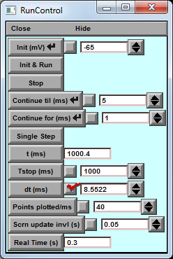 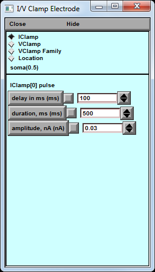 
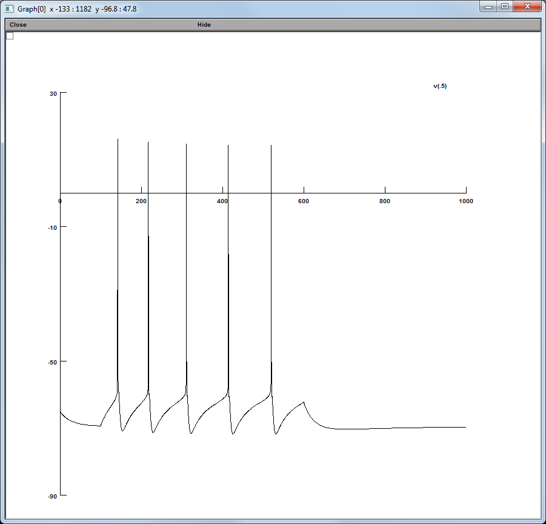

- Press ‘init & Run’ to simulate.
- Try changing the injected current magnitude to control the number of spikes.
- In the console, try typing `init_WT_passive()` or `init_KO_passive()` to switch between the cell intrinsic properties of the WT and _Fmr1-KO_ simulation , respectively. 
- To compare the voltage responses, keep the previous lines on the graph window screen by right-clicking>keep lines.

---

### `Sim1_Single_stim_subthreshold_FFI_response.hoc`
This simulates the effect of FFI on the postsynaptic currents (Blue: EPSC, Red: IPSC) and membrane potential (black) of the model layer IV stellate cell in response to a single model thalamic input. 

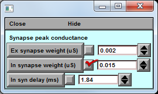 
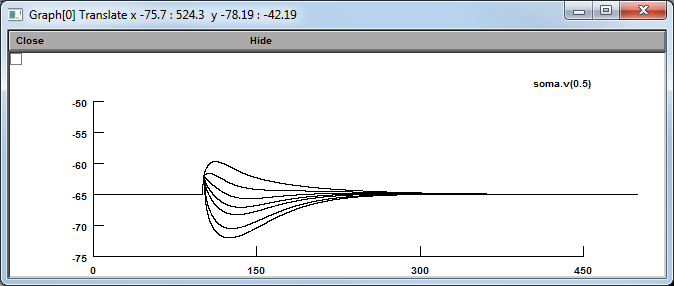 
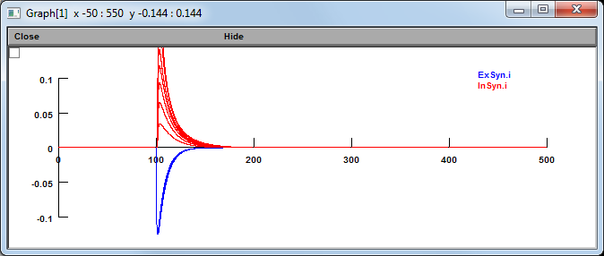

- Press ‘init & Run’ to simulate.
- Examine the Vm effect of varying the strength of the Ex and In synaptic weights, and the synaptic delays between the two input currents. 
- In the console, try typing `init_WT_passive()` or `init_KO_passive()` to switch between the cell intrinsic properties of the WT and _Fmr1-KO_ simulation, respectively. 
- To compare the voltage responses, keep the previous lines on the graph window screen by right-clicking>keep lines.

---

### `Sim2_Effect_of_FFI_on_subthreshold_summation.hoc`
This simulation explores the role of different pathophysiological parameter groups on thalamocortical integration. 

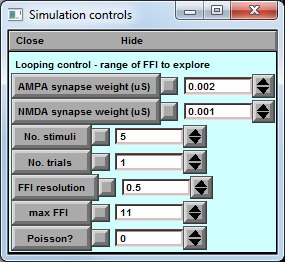 
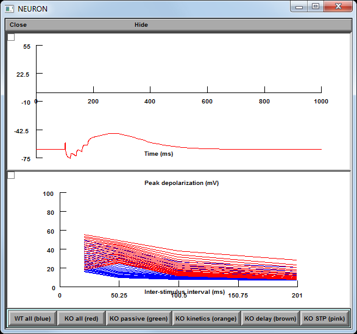 

Each of the lower buttons in the simulation graph window takes a different group of parameter and changes that subset of parameters in the WT simulation case. 

Starting with no FFI, the program runs in a loop over a range of values of Ex/In balance (FFI strengths) and input stimulation frequencies, parameterised by ranges from {0:FFI resolution:max FFI} in the control box and {1:1:201}ms, respectively.

The lower graph window plots the peak voltage deflection achieved in each simulation, with colours matching the simulation group as detailed in the buttons below. Each line connects values obtained at one FFI strength value. 

Supports Figure 7A in the paper.
- Try changing the number of stimuli
- Observe the effect of varying the relative contributions of AMPA and NMDA conductances.

--- 

### `Sim3_Effect_of_FFI_on_spike_output.hoc`
This simulation repeats the loop of `Sim2` additionally including model voltage-gated conductances supporting spike generation. 

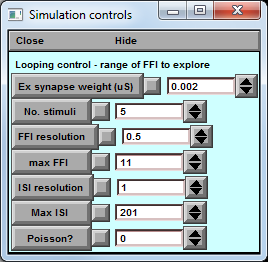 
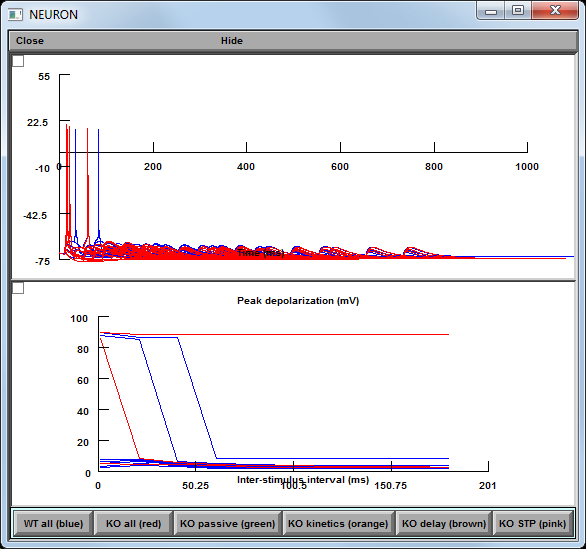 

The peak depolarization plot now captures which conditions of {pathophysiological effect, FFI strength, Inter-stimulus interval, number of inputs} provide sufficient depolarisation to make the cell fire.

Supports Figure 7B-C in the paper.

---

### `Sim4_Effect_of_FFI_on_spike_timing.hoc`
This simulation investigates the role of the parameter ranges tested in `Sim2` and `Sim3` on the temporal fidelity and temporal coincidence detection performance of the model system by providing repetitive trials of Poisson-jittered input trains at each modal inter-pulse interval tested. 

 
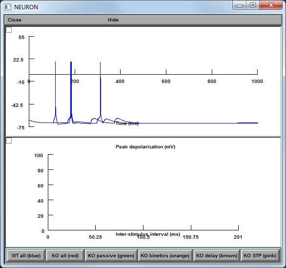 

Supports Fig 7C in the paper.

---

### `Sim5_Simulated_rescue_scenarios.hoc`
Evaluating simulated rescue scenarios based on parameter groupings.

Supports Fig 8 in the paper.

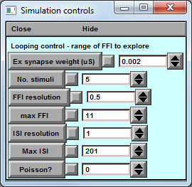 
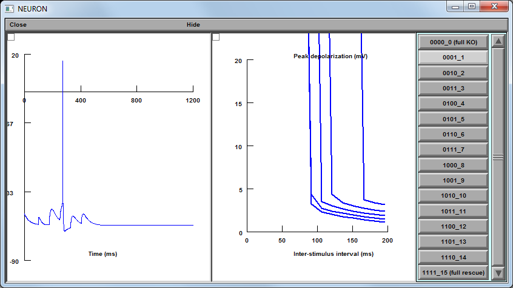 

This simulation takes the four thalamocortical pathophysiology parameter groups studied in the simulations above:
1.	Intrinsic cell excitability
2.	Synaptic kinetics
3.	Excitation-Inhibition synaptic delay
4.	Short-term plasticity
... and starting with an _Fmr1-KO_ simulation (condition code ‘0000’) combinatorically replaces KO parameter group values with corresponding WT ones, moving through each combination of 16 parameter rescue scenario until the full WT model condition (code ‘1111’) is achieved. 

Under this nomenclature, condition code ‘1010’ represents WT values for Intrinsic cell excitability and Excitation-Inhibition synaptic delay, but KO Synaptic kinetics and Short-term plasticity.

The response profiles for each parameter rescue condition across the space of FFI strength (Ex/In balance) and thalamocortical input rate are calculated: i.e. did the model neuron fire fewer or greater numbers of spikes under identical stimulation conditions.

